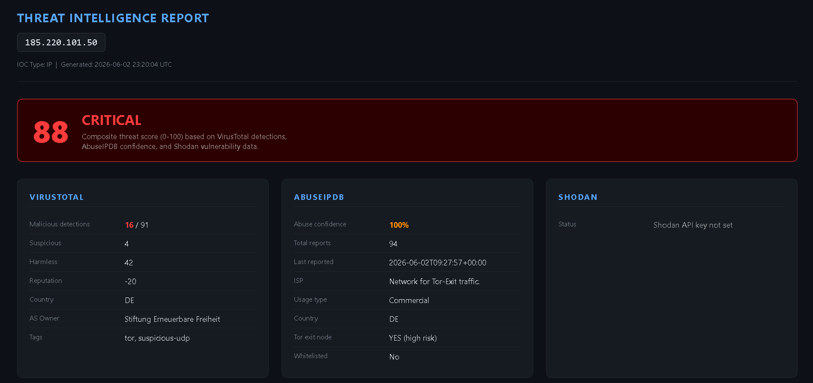

# Threat Intelligence Automation Tool

A Python-based threat intelligence tool that automates IOC (Indicator of Compromise) investigation by querying multiple threat intelligence sources and generating detailed HTML reports.

---

## Demo



> Report generated for `185.220.101.50` — identified as a **CRITICAL** Tor exit node with 100% abuse confidence and 16/91 malicious detections on VirusTotal.

---

## What It Does

Given an IP address, domain, or file hash, the tool automatically:

- Queries **VirusTotal** for malware detections and reputation score
- Queries **AbuseIPDB** for abuse reports, ISP info, and Tor node status
- Queries **Shodan** for open ports, services, and known CVEs
- Calculates a **composite risk score (0–100)** using a custom scoring algorithm
- Generates a clean, dark-themed **HTML report** with all findings

This mirrors the real-world SOC analyst workflow of triaging suspicious IPs and domains during incident response.

---

## Sample Findings

| IOC | Type | Risk Score | Label | Key Findings |
|-----|------|-----------|-------|--------------|
| 185.220.101.50 | IP | 88/100 | 🔴 CRITICAL | Confirmed Tor exit node, 100% AbuseIPDB confidence, 16/91 malicious VT detections, 94 abuse reports — reported same day |
| 45.33.32.156 | IP | 18/100 | 🔵 LOW | Akamai/Linode hosted, 3/91 VT detections, 12% abuse confidence, 4 reports — likely scanner or noisy host |
| 198.199.10.234 | IP | 0/100 | 🟢 CLEAN | 0 detections, 0 reports, Bell Textron ISP — no threat indicators found |
| malware-test.com | Domain | 32/100 | 🟡 MEDIUM | 6/91 malicious VT detections, 1 suspicious — flagged by multiple vendors despite low-reputation domain |

---

## Analyst Notes

**185.220.101.50** — Do not block and investigate blindly. Tor exit nodes carry traffic from many users; the real attacker's IP is masked. Seeing this in firewall logs indicates a user on the network is routing through Tor, which is itself a policy violation worth escalating.

**45.33.32.156** — Low risk but worth monitoring. Hosted on Linode (common for VPS abuse), 3 VT detections suggest some vendor flagging. Not immediately actionable but should be correlated against internal logs.

**198.199.10.234** — Clean across all sources. Bell Textron is a legitimate defense/aerospace ISP. False positive or benign traffic — no action needed.

**malware-test.com** — Medium risk domain. 6 vendor detections on a domain with "malware" in the name warrants blocking at the DNS/proxy layer as a precaution. AbuseIPDB and Shodan are IP-only, so domain confidence is lower — cross-reference with passive DNS if available.

---

## Tech Stack

| Tool | Purpose |
|------|---------|
| Python 3 | Core scripting |
| VirusTotal API | Malware detection data |
| AbuseIPDB API | IP abuse reports |
| Shodan API | Open ports & CVEs |
| HTML/CSS | Report generation |

---

## Project Structure

```
Threat-Intel-Tool/
├── threat_intel.py       # Main script
├── reports/              # Generated HTML reports
│   ├── threat_report_185_220_101_50.html
│   ├── threat_report_45_33_32_156.html
│   ├── threat_report_198_199_10_234.html
│   └── threat_report_malware-test_com.html
├── screenshots/          # Report screenshots
│   └── report-demo.png
└── README.md
```

---

## Setup & Usage

### 1. Clone the repo
```bash
git clone https://github.com/yourusername/Threat-Intel-Tool.git
cd Threat-Intel-Tool
```

### 2. Install dependencies
```bash
pip install requests>=2.28.0
```

### 3. Set API keys as environment variables

**Windows (PowerShell):**
```powershell
$env:VT_API_KEY="your_virustotal_key"
$env:ABUSEIPDB_API_KEY="your_abuseipdb_key"
$env:SHODAN_API_KEY="your_shodan_key"
```

**Linux/macOS:**
```bash
export VT_API_KEY="your_virustotal_key"
export ABUSEIPDB_API_KEY="your_abuseipdb_key"
export SHODAN_API_KEY="your_shodan_key"
```

### 4. Run the tool

```bash
# Investigate an IP
python threat_intel.py 185.220.101.50

# Investigate a domain
python threat_intel.py malware-test.com

# Investigate a file hash
python threat_intel.py d41d8cd98f00b204e9800998ecf8427e

# Output as JSON instead of HTML
python threat_intel.py 1.2.3.4 --output json
```

---

## Risk Scoring Logic

The composite score (0–100) is calculated as follows:

| Source | Factor | Max Points |
|--------|--------|-----------|
| VirusTotal | Malicious detections × 5 | 40 |
| VirusTotal | Suspicious detections × 2 | 10 |
| AbuseIPDB | Abuse confidence × 0.3 | 30 |
| AbuseIPDB | Tor exit node flag | 10 |
| Shodan | Known CVEs × 5 | 20 |

| Score | Label |
|-------|-------|
| 70–100 | 🔴 CRITICAL |
| 40–69 | 🟠 HIGH |
| 20–39 | 🟡 MEDIUM |
| 5–19 | 🔵 LOW |
| 0–4 | 🟢 CLEAN |

---

## API Keys (Free Tier)

| Service | Free Tier | Link |
|---------|-----------|------|
| VirusTotal | 500 requests/day | [virustotal.com](https://virustotal.com) |
| AbuseIPDB | 1000 requests/day | [abuseipdb.com](https://abuseipdb.com) |
| Shodan | Basic lookups | [shodan.io](https://shodan.io) |

---

## Skills Demonstrated

- Threat intelligence gathering and IOC triage
- REST API integration (VirusTotal, AbuseIPDB, Shodan)
- Python scripting for security automation
- Custom composite risk scoring algorithm
- HTML report generation for analyst consumption
- Real-world SOC L1 workflow simulation

---

## Related Projects

- [Splunk SIEM Lab](https://github.com/yourusername/Splunk-SIEM-Lab) — Log analysis and detection engineering with Splunk

---

*Built as part of a cybersecurity portfolio. All IOCs investigated are publicly known malicious or test indicators.*
